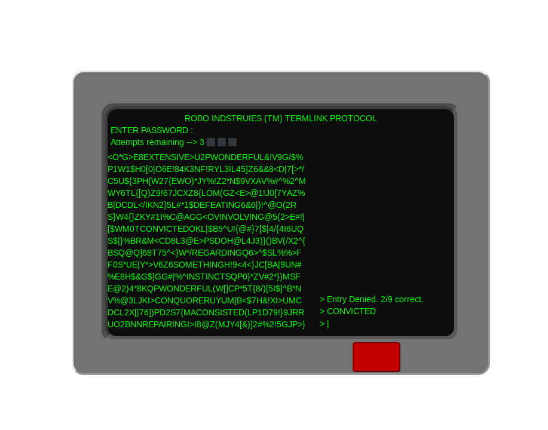

# Fallout Hacking Game

Implementation of Fallout 3's Hacking Terminal Created in Javascript <br>
A Pen created at CodePen.io with over 1500 plays. Original URL: [https://codepen.io/GrandDuchy/pen/rrpBWZ](https://codepen.io/GrandDuchy/pen/rrpBWZ).

<p align="center">
 
</p>

## Getting Started

Clone this repository
```
git clone https://github.com/Grandduchy/Fallout-Hacking-Game
```
Open index.html file with your prefered web browser in dist folder, command will vary
```
cd Fallout-Hacking-Game/dist
firefox index.html
```

## Built With

* [JQuery](https://jquery.com/) - Javascript Library
* [Sass](https://sass-lang.com/) - CSS preprocessor

## Authors

* **Joshua Challenger** - *Complete Project* - [Grandduchy](https://github.com/Grandduchy)

## License

This project is licensed under the MIT License - see the [LICENSE](LICENSE) file for details

## Acknowledgments

* (Reddit's Daily Programmer)[https://www.reddit.com/r/dailyprogrammer/comments/3qjnil/20151028_challenge_238_intermediate_fallout/], Where the idea for the project came from

